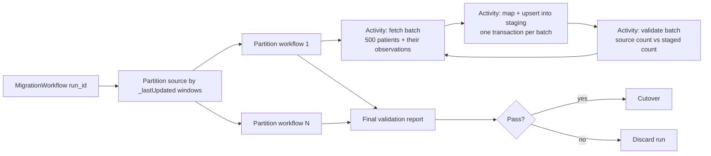

# Migration plan — 50,000 patients from a FHIR R4 API

Goal: move ~50,000 `Patient` resources and their `Observation`s (order of magnitude: ~500,000) from a legacy system exposed as a FHIR R4 API into a new internal service, without losing or corrupting data, without overloading the source, and with PHI handled as PHI at every step.

## 1. Approach

**Extraction.** If the source supports FHIR Bulk Data (`$export`), use it: one asynchronous export, NDJSON files per resource type, designed for exactly this volume. Otherwise, fall back to paged search, which is what the working slice in this repo implements:

- `Patient?_count=500`, following `link[next]`;
- for each page of patients, **one** grouped search `POST Observation/_search` with `subject=Patient/a,Patient/b,…` (500 references; POST avoids URL-length limits);
- gzip on every response (measured on the sandbox: a 500-observation page goes from 672 KB to 23 KB).

That is ~1,200 requests for 50k patients instead of 50,000+ with a per-patient loop. One trap to avoid: `_revinclude=Observation:subject` looks ideal but the HAPI server silently caps included resources at 1,000 per page — data would be lost without any error.

**Orchestration (Temporal).** One parent workflow per migration run:

- **Reliable**: every activity is idempotent (upsert keyed on the FHIR id), so Temporal's retries and a crashed worker resuming are always safe. A batch is written in a single transaction: fully migrated or not at all. The workflow records the last completed batch per partition, so a failure resumes there, not from zero. Activities return counts and ids only, never resource payloads, to keep workflow history small.
- **API limits and throughput**: within a partition, pages are fetched one after the other (each `next` cursor comes from the previous response); parallelism happens **across** partitions, and is bounded. Sizing: ~1,200 requests at ~1 s each is ~20 minutes sequentially, ~5 minutes with 4 partitions — so the degree of parallelism is set by what the source can absorb without slowing down its clinical users, not by our side. Start low, raise it while latency and 429 rates stay flat. Plus a rate limit per worker, `429`/`503` retried with exponential backoff and `Retry-After` honoured; other `4xx` fail fast as non-retryable. Run off-peak; never `_total=accurate` (expensive on the server).
- **Live source**: full load, then a delta catch-up (`_lastUpdated=gt<run start>`, including deletions), then a short write freeze and the cutover.
- **Observable**: per-batch metrics (resources fetched / written / skipped, retries, 429s, latency), progress in the Temporal UI and a dashboard, structured logs carrying run and batch ids, alerts on error rate and stalled heartbeats.

## 2. Data mapping

| Internal field | FHIR source | Rule |
|---|---|---|
| **Patient** `fhir_id` (unique) | `Patient.id` | Idempotency key |
| `family_name`, `given_names` | `name[]` | First `official`, else `usual`, else first entry; `text` if no parts |
| `gender` | `gender` | FHIR value set, else null |
| `birth_date` | `birthDate` | Full date only; partial dates (`1970`, `1970-05`) → null, kept in the raw resource |
| **Observation** `fhir_id` (unique) | `Observation.id` | Idempotency key |
| `patient` (FK) | `subject.reference` | Relative, absolute or versioned reference normalised to `Patient/<id>`; anything else → rejected and counted |
| `status`, `category` | `status`, `category[0].coding[0].code` | As is |
| `code_system`, `code`, `display` | `code.coding[]` | LOINC coding first, else first coding; `display` else `code.text` |
| `value_type` + `value_number`, `value_unit`, `value_text` | `value[x]` | `quantity` (decimal, never float), `concept`, `string`, `components`, `none` |
| `components` | `component[]` | Simplified list, e.g. systolic / diastolic blood pressure |
| `effective_at` | `effectiveDateTime` > `effectiveInstant` > `effectivePeriod.start` | Full timestamp with timezone only, else null |

Units are kept as sent (UCUM), never converted. The raw source resource is kept alongside each row for traceability and re-mapping, in encrypted storage with a retention limit (purged after sign-off). A malformed resource is rejected and counted, never allowed to fail its batch.

## 3. Validation

- **Counts, per batch**: source count (`_summary=count` on the same grouped search) vs rows staged. The working slice does this for every batch at the cost of one request per batch.
- **Integrity**: no orphan observation, unique `fhir_id`, every source id present exactly once.
- **Field-level reconciliation**: a random sample re-fetched from the source and compared field by field through the same mapping.
- **Distribution checks**: share of each `value_type`, null rates and date ranges vs the source profile, so that a silent mapping regression shows up as a number.
- **Sign-off**: a validation report attached to the run, reviewed by the data owner (and a clinical reviewer on a sample) before cutover.

## 4. Safety (PHI)

- **Minimum necessary**: only the fields the new service needs, plus the raw resource for a limited time.
- **Encryption** in transit (TLS) and at rest; secrets in a vault; read-only, least-privilege credentials on the source (e.g. SMART Backend Services).
- **Logs carry run and batch ids only.** A FHIR resource id is itself an identifier under HIPAA Safe Harbor: resource-level ids go to an access-controlled audit log, not to application logs. (The slice logs FHIR ids because its data is synthetic.)
- Role-based access and audit trail on the staging and target stores; non-production environments use synthetic data only; a BAA with every vendor in the data path.

## 5. Rollback

- The source is **read-only** for the migration: it is never modified, so it remains the system of record until sign-off.
- Every row is tagged with its `migration_run_id` and lands in **staging**. Cutover is a single atomic switch, done only if validation passes.
- **Failure mid-run**: resume from the last completed batch (idempotent upserts, atomic batches: no partial batch to clean up).
- **Bad run before cutover**: delete that run's rows and start again.
- **Problem after cutover**: switch the read path back to the legacy system, fix, and re-run the delta.
